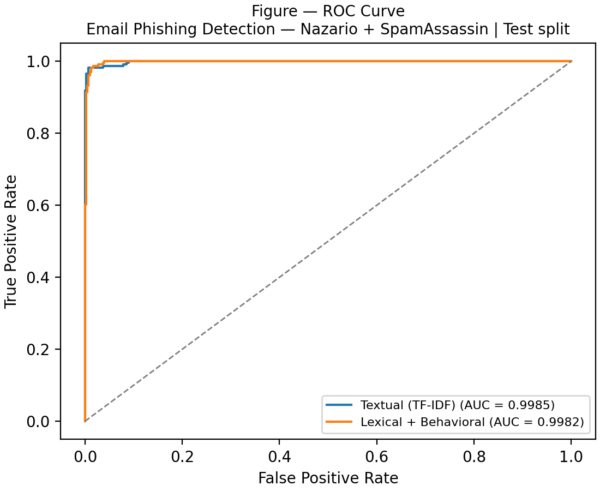
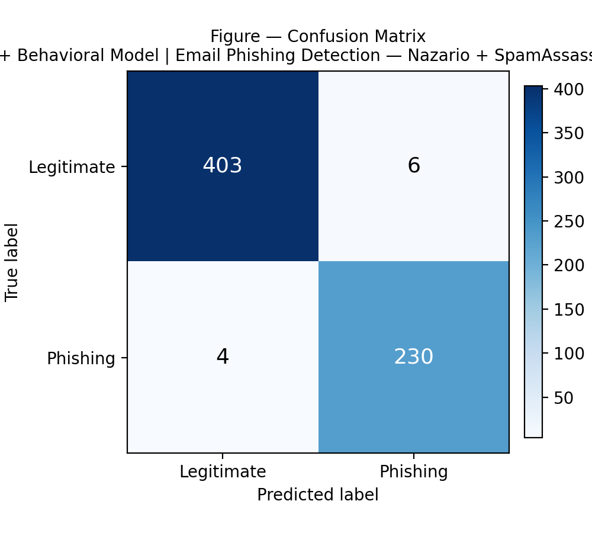

# MAL-PhishNet

**Multimodal Adversarial Learning Phishing Detection Network**

This repository contains the research code accompanying our paper on phishing
detection using multiple independent models — Text, Behavioral, URL, and Web
Content — later combined through a Cloud Fusion Layer.

## Overview

MAL-PhishNet trains **four independent classifiers**, each on its own
dataset and feature pipeline:

| Model            | Data source(s)                                         | Features                                  |
|------------------|----------------------------------------------------------|--------------------------------------------|
| Text             | Nazario (phishing) + SpamAssassin (legitimate) emails    | TF-IDF                                     |
| Behavioral       | Same email corpus as Text                                 | Handcrafted lexical / behavioral features  |
| URL              | PhishTank (phishing) + Cisco Umbrella Top 1M (benign)     | Handcrafted URL-string features            |
| Web Content      | Mendeley CompPhish v2 (paired URL + HTML + label)          | Handcrafted HTML/DOM structural features   |

Each model has its own train/validation/test split (never shared across
models) and is evaluated independently. A **Cloud Fusion Layer** then
combines the prediction probabilities of all four models on a paired,
held-out multimodal test set.

## Repository Structure

```
MAL-PhishNet/
├── MAL_PhishNet.ipynb           # Main notebook (all pipeline cells)
├── README.md                    # This file
├── requirements.txt             # Python dependencies
├── LICENSE
└── results/
    ├── figures/                 # ROC curve, confusion matrices
    ├── tables/                  # Metrics table (CSV)
    └── reports/                 # Full paper-ready results (JSON)
```

## Notebook Contents

The notebook is organized into sequential, dependent cells:

1. **Environment Setup** — config, logging, seeding, GPU/AMP detection, Google Drive mount, checkpointing utilities.
2. **Multi-Model Dataset Acquisition** — downloads/prepares the Text, URL, and Web Content datasets.
3. **Multi-Model Feature Engineering** — builds independent feature matrices per model.
4. **Multi-Model Architecture Factory** — builds unfitted estimators (Logistic Regression / Random Forest / XGBoost) per model.
5. **Multi-Model Training** — fits each model independently.
6. **Multi-Model Evaluation + Cloud Fusion Layer** — evaluates each model on its own held-out test split and builds the fusion layer.
7. **Paper Report (Email-only)** — generates paper-ready results/tables for the email-based experiment.

> Cells must be run in order (1 → 7), as later cells depend on objects defined by earlier ones.

## Results — Email Experiment (Nazario + SpamAssassin)

This is the first paper experiment: Text (TF-IDF) and Behavioral (lexical +
handcrafted) features, each trained as an **independent** Random Forest on
the email corpus only (URL, Web Content, and Cloud Fusion excluded from this
experiment).

**Dataset:** 1,564 phishing (Nazario) + 2,720 legitimate (SpamAssassin
easy_ham + hard_ham) = 4,284 emails → 2,998 train / 643 validation / 643 test.

| Model                 | Test samples | Threshold | Accuracy | Precision | Recall | F1-score | ROC-AUC | PR-AUC |
|------------------------|:------------:|:---------:|:--------:|:---------:|:------:|:--------:|:-------:|:------:|
| Textual (TF-IDF)        | 643 | 0.4729 | 0.9829 | 0.9705 | 0.9829 | 0.9766 | 0.9985 | 0.9976 |
| Lexical + Behavioral     | 643 | 0.5025 | 0.9844 | 0.9746 | 0.9829 | 0.9787 | 0.9982 | 0.9964 |

Full metrics (incl. specificity, MCC, confusion matrices) are in
[`results/reports/email_experiment_paper_results.json`](results/reports/email_experiment_paper_results.json),
and the raw table is in
[`results/tables/Table_Email_Experiment_Metrics.csv`](results/tables/Table_Email_Experiment_Metrics.csv).

**ROC Curve**



**Confusion Matrices**

<table>
<tr>
<td></td>
<td></td>
</tr>
</table>

> Note: the current implementation trains Text and Behavioral as two
> independent models — there is no single fused feature matrix / classifier
> producing one combined number for this experiment. Both are reported
> side by side rather than an invented fused metric.

## Getting Started

### Option 1 — Google Colab (recommended)
Click the badge below to open and run the notebook directly in Colab (update the link once uploaded):

[](https://colab.research.google.com/github/<your-username>/MAL-PhishNet/blob/main/MAL_PhishNet.ipynb)

### Option 2 — Local / Jupyter
```bash
git clone https://github.com/<your-username>/MAL-PhishNet.git
cd MAL-PhishNet
pip install -r requirements.txt
jupyter notebook MAL_PhishNet.ipynb
```

## Requirements

See `requirements.txt`. Core dependencies: `torch`, `numpy`, `pandas`,
`scikit-learn`, `xgboost`, `pillow`, `psutil`, `gdown`.

## Citation

If you use this code in your research, please cite our paper:

```bibtex
@article{malphishnet2026,
  title   = {MAL-PhishNet: Multimodal Adversarial Learning for Phishing Detection},
  author  = {<Your Name(s)>},
  journal = {<Journal / Conference Name>},
  year    = {2026}
}
```

## License

This project is released under the MIT License — see [LICENSE](LICENSE) for details.
"# MAL-PhishNet" 
